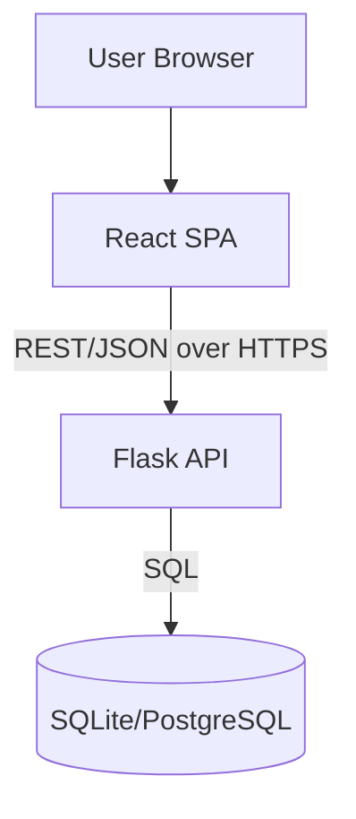

# DT2 Crop Manager

A full-stack crop management platform that lets farmers track crop records, monitor harvests, and run yield predictions. The project is split into a Flask API backend and a React SPA frontend that communicates via REST endpoints.

## Live demo

- **Production site:** https://dt2-crop-manager-project.onrender.com

## Tech stack

- **Frontend:** React, React Router, Recharts, Axios
- **Backend:** Flask with blueprints for auth, crop, harvest, and prediction routes
- **Containerization:** Docker + Docker Compose for local orchestration

## Project structure

- `backend/` – Flask application entrypoint (`app.py`), blueprints under `crop_tracker/`, and Python dependencies in `requirements.txt`.
- `frontend/cropmanager-frontend/` – React application (Create React App) with pages, components, and API helpers under `src/`.
- `docker-compose.yml` – Spins up both services for local development with sensible defaults.

## Local development

### Prerequisites

- Python 3.10+ with `pip`
- Node.js 18+ with `npm`
- Docker (optional, for containerized setup)

### Option 1: Run with Docker Compose

1. Build and start both services:
   ```bash
   docker-compose up --build
   ```
2. Frontend: http://localhost:3000
3. Backend API: http://localhost:8000

### Option 2: Run services manually

**Backend (Flask)**
1. Install dependencies:
   ```bash
   cd backend
   pip install -r requirements.txt
   ```
2. Start the API server (defaults to port 8000):
   ```bash
   python app.py
   ```

**Frontend (React)**
1. Install dependencies:
   ```bash
   cd frontend/cropmanager-frontend
   npm install
   ```
2. Point the frontend at your API (optional if using the default `http://localhost:8000`):
   ```bash
   export REACT_APP_API_BASE=http://localhost:8000
   ```
3. Start the dev server (defaults to port 3000):
   ```bash
   npm start
   ```

## Environment variables

- `REACT_APP_API_BASE` – Frontend base URL for the API. Defaults to `http://localhost:8000` for local dev and is overridden in `docker-compose.yml` for containerized runs.
- `SECRET_KEY` – Flask secret key; defaults to `MYSECRET_KEY` if not provided.

## Testing

- Frontend: `npm test` from `frontend/cropmanager-frontend`
- Backend: add your preferred test runner (e.g., `pytest`) and point it at `backend/`


## What the project does

DT2 Crop Manager helps farming teams keep all their crop information in one place and surface insights that guide planting, harvesting, and inventory decisions.

### Core features

- **Crop records** – Add crops with name, variety, planting date, and expected harvest windows.
- **Harvest tracking** – Log harvest events (date, quantity, and notes) to understand performance over time.
- **Yield forecasting** – Use stored crop and harvest data to generate yield predictions.
- **Dashboard views** – Visualize production trends and compare harvests across seasons.
- **User authentication** – Secure access to API endpoints with user accounts and tokens.

### How it works (architecture)

- **Frontend**: A React single-page app that calls the backend via Axios. Routing is handled by React Router and charts are rendered with Recharts.
- **Backend**: A Flask API that exposes blueprinted routes for auth, crops, harvests, and predictions. Responses are JSON so the frontend can render data dynamically.
- **Data**: Crop and harvest records are stored in the backend datastore; prediction endpoints derive insights from these records.
- **Deployment**: Docker images for the frontend and backend are orchestrated with Docker Compose for local dev and deployed together to the production Render instance.

### Key API routes

- `POST /auth/register` / `POST /auth/login` – Create or authenticate a user and receive a token.
- `GET /crops` / `POST /crops` – List crops or add a new crop record.
- `GET /crops/<id>` / `PUT /crops/<id>` / `DELETE /crops/<id>` – Retrieve, update, or delete a specific crop.
- `GET /harvests` / `POST /harvests` – View or log harvest events.
- `GET /predictions` – Fetch yield predictions based on existing data.

### Why it matters

- Centralizes crop history so teams can avoid siloed spreadsheets.
- Tracks harvest performance against expectations to surface underperforming fields.
- Provides quick forecasts that support planning for sales, storage, and logistics.

# API Documentation

Base URL: `/api`

## Authentication
- **POST** `/api/register`
  - Body: `{ "email": "user@example.com", "username": "farmer1", "password": "secret123" }`
  - Response: `201 Created` `{ "success": true, "userId": 1 }`
- **POST** `/api/login`
  - Body: `{ "email": "user@example.com", "password": "secret123" }`
  - Response: `200 OK` `{ "success": true, "userId": 1 }`
- **POST** `/api/reset-password`
  - Body: `{ "email": "user@example.com" }`
  - Response: `200 OK` `{ "success": true, "token": "uuid" }`
- **POST** `/api/reset-password/<token>`
  - Body: `{ "password": "newSecret123" }`
  - Response: `200 OK` `{ "success": true, "message": "Password reset successful" }`

## Crops
- **POST** `/api/crop/<user_id>`
  - Body: `{ "name": "Maize", "area": 2.5, "planting_date": "2025-02-01" }`
  - Response: `201 Created` `{ "message": "Crop added successfully!" }`
- **GET** `/api/crop/<user_id>?page=1&limit=5`
  - Response: `200 OK` `{ "data": [...], "page": 1, "limit": 5, "total": 10 }`
- **PUT** `/api/crop/<crop_id>/<user_id>`
  - Body: `{ "name": "Beans", "area": 1.2, "planting_date": "2025-03-01" }`
  - Response: `200 OK` `{ "message": "Crop updated successfully!" }`
- **DELETE** `/api/crop/<crop_id>/<user_id>`
  - Response: `200 OK` `{ "message": "Crop deleted successfully!" }`
- **POST** `/api/harvest/<crop_id>/<user_id>`
  - Body: `{ "date": "2025-04-10", "yield_amount": 120.5 }`
  - Response: `201 Created` `{ "message": "Harvest recorded successfully" }`

## Harvests
- **GET** `/api/harvests?user_id=1`
  - Response: `200 OK` `[ { "id": 3, "crop_name": "Maize", "date": "2025-04-10", "yield_amount": 120.5 } ]`
- **GET** `/api/harvests/stats?user_id=1`
  - Response: Aggregates by crop `{ "stats": [...], "overall_total_yield": 400 }`
- **GET** `/api/harvests/summary/yearly?user_id=1`
  - Response: `{ "yearly": [ { "year": "2024", "total_yield": 500 } ] }`
- **GET** `/api/harvests/summary/top-crops-yearly?user_id=1&from=2023&to=2025&top=5`
  - Response: `{ "from": 2023, "to": 2025, "top": 5, "top_names": ["Maize"], "series": [...] }`
- **GET** `/api/harvests/filter/crop-year?user_id=1&crop=Maize&year=2025`
  - Response: `{ "crop": "Maize", "year": 2025, "planted_count": 2, "harvest_events": 3, "total_yield": 320, "avg_yield": 106.7, "monthly": [...] }`
- **GET** `/api/harvests/seasonality?user_id=1&from=2023&to=2025`
  - Response: `{ "monthly": [ { "month": 1, "total_yield": 50 } ] }`
- **GET** `/api/harvests/distribution?user_id=1&from=2023&to=2025`
  - Response: `{ "buckets": [ { "label": "0-9", "count": 2 } ] }`

## Predictions (AI)
- **GET** `/api/predict/<crop_id>?user_id=1`
  - Response: `200 OK` with predicted yield, per-acre estimate, confidence, category, and tips.
  - Example: `{ "predicted_yield": 1340.5, "yield_unit": "kg", "yield_category": "Medium", "tips": ["Keep regular weeding and correct spacing.", ...] }`

### Error handling
- Invalid input returns a `400` with an `error` message.
- Unauthorized/unknown resources return `401` or `403` depending on the route.
docs/ARCHITECTURE.md
New
+32
-0

# Architecture Overview

The system is a two-service stack: a React single-page app that calls a Flask API. Both services are containerized and orchestrated together for local development and cloud deployment.



## Components
- **Frontend (React)**: Handles routing, forms for crop and harvest entry, dashboard charts, and calls prediction endpoints. Axios is configured with `REACT_APP_API_BASE` to reach the Flask API.
- **Backend (Flask)**: Blueprints for authentication, crops, harvest analytics, and yield prediction. CORS is enabled for both the deployed site and local dev origins.
- **Database**: SQLite by default for local development; switches to PostgreSQL automatically when `DATABASE_URL` is provided (Render deployment).
- **Containerization**: `docker-compose.yml` builds and runs both services with port mappings (3000 for frontend, 8000 for backend) and shared environment variables.

## Data flow
1. Users authenticate through `/api/login` and receive a session-bound user id.
2. Crop and harvest forms POST to `/api/crop/<user_id>` and `/api/harvest/<crop_id>/<user_id>`; records are persisted in the database.
3. Dashboard views fetch analytics via `/api/harvests/...` routes for stats, yearly summaries, and distributions.
4. The AI module reads crop and harvest history to predict yields via `/api/predict/<crop_id>`, returning categories and actionable tips.

## Deployment
- **Render** hosts both services; PostgreSQL is used when available via `DATABASE_URL`.
- **GitHub Actions** builds and tests backend and frontend on pushes/PRs to `main` and `dev`.
- **Environment variables**: `REACT_APP_API_BASE` (frontend API base), `SECRET_KEY` (Flask sessions), `DATABASE_URL` (PostgreSQL DSN when deployed).

  # Submission Artifacts

Use this checklist to ensure the final hand-in meets course requirements.

- **GitHub repository:** https://github.com/Chiba20/DT2_Crop_Manager_Project.git (add all collaborators + instructors).
- **Branches:** `main` (protected) and `dev` with feature branches merged via PRs.
- **Live deployment URL:** https://dt2-crop-manager-project.onrender.com
- **API docs:** See `docs/API.md` (export Postman/Swagger if desired).
- **Architecture diagram:** See `docs/ARCHITECTURE.md`.
- **AI/ML notes:** See `docs/AI_MODEL.md` (model choice, data source, evaluation).
- **Video demo (5–7 minutes):** https://drive.google.com/file/d/1GmYeiXvurCEa-eBIDSuYQYtDfHAw96hN/view?usp=sharing
- **Presentation slides:** https://drive.google.com/file/d/1xBa0DXQfLITwFaDxbFhEaXkLM0H2UvEi/view?usp=sharing
- **Individual contribution :** Ayman Hamza Haji (Module1: Crop tracker) , Nas-bah Khamis Isaa (Module2: Harvest Dashboard) , Nabiha walid Kassim (Module3: Yield Predictor).
- **Environment variables:** Documented in README and deployment settings; no secrets in git.
- **GitHub Actions:** CI workflow in `.github/workflows/ci.yml` (backend + frontend tests).
